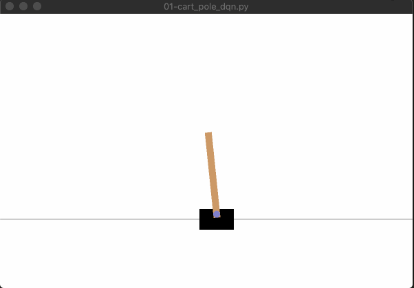
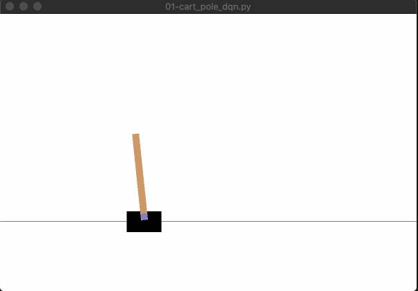
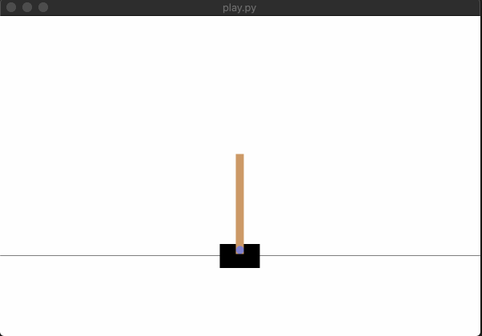
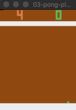
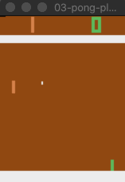
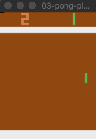

# Applying Deep Reinforcement Learning using PyTorch.
This implementations is part of the study of the course from [Phil Tabor](https://www.udemy.com/course/deep-q-learning-from-paper-to-code)

## Cart-Pole-V1: using 4 states

#### After (~60 episodes), agent begin to play and keep the pole upright

#### After (~ 200 episodes) the agent master the game.

## Pong: using images as input states

#### Begin of play. Agent knows nothing about the environment.

#### After (~60 episodes), agent begin to play and keep the pole upright

#### After (~ 200 episodes) the agent master the game.

## Doom: Double DQN algorithm
